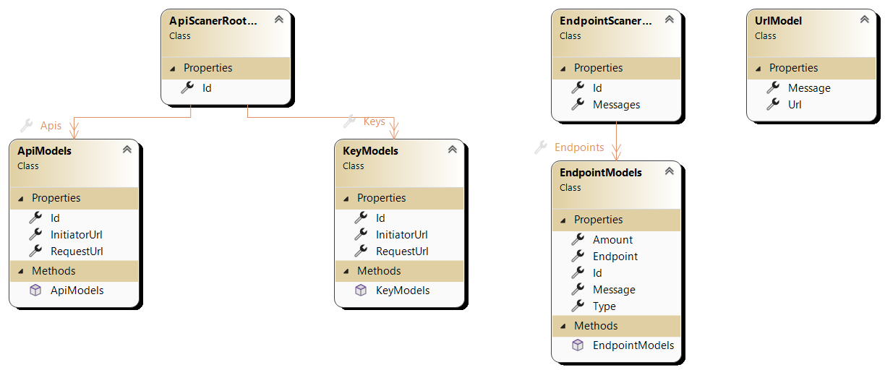
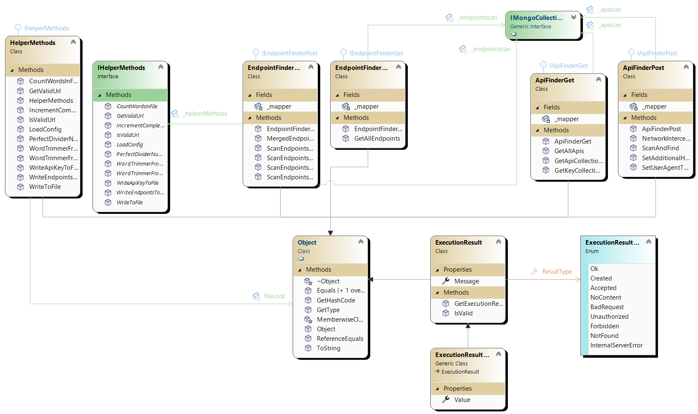

  

# ScanApi

ScanApi is a web application designed for scanning APIs and endpoints within a given URL. It provides functionalities to scan APIs, endpoints, and various combinations of them, filtering out certain types of endpoints based on user preferences.

## Table of Contents

- [Overview](#overview)
- [Setup](#setup)
- [Usage](#usage)
- [API](#api)
- [Contributing](#contributing)
- [License](#license)

## Overview

ScanApi consists of two main components:
- **API Scanner**: Scans for APIs within a given URL.
- **Endpoint Scanner**: Scans for endpoints within a given URL.

The application is built using ASP.NET Core and MongoDB for data storage. It employs AutoMapper for object-object mapping and Swagger for API documentation.

## Setup

To set up the ScanApi application, follow these steps:

1. **Clone the Repository**: Clone the ScanApi repository to your local machine.
2. **Install Dependencies**: Run `dotnet restore` to install the necessary dependencies.
3. **Configure MongoDB**: Update the MongoDB connection string and database settings in the `appsettings.json` file.
4. **Configure Config.Json**: Update the Direction of 'TextPath' and 'DomainPath' if you want to work with .txt files.
5. **Run the Application**: Execute `dotnet run` to start the application.

## Usage

Once the application is running, you can interact with it through its API endpoints. The main functionalities include:

- **API Scanner Endpoints**:
  - `POST /scanapi/scanApis/{url}`: Scan for APIs within the specified URL.
  - `GET /getApis`: Get all scanned APIs.
  - `GET /getApis/{id}`: Get APIs by ID.

- **Endpoint Scanner Endpoints**:
  - `GET /getEndpoints`: Get all scanned endpoints.
  - `POST /scanapi/scanEndpointsAll/{url}`: Scan all types of endpoints within the specified URL.
  - `POST /scanapi/scanEndpointsClean/{url}`: Scan only clean endpoints within the specified URL.
  - `POST /scanapi/scanEndpointsOnlyApi/{url}`: Scan only API endpoints within the specified URL.
  - `POST /scanapi/scanEndpointsOnlyS/{url}`: Scan only endpoints with 's' within the specified URL.
  - `POST /scanapi/scanEndpointsOnlyApiAndS/{url}`: Scan only API and 's' endpoints within the specified URL.

---

## UML

### Models

### Explanation of Models

#### ApiModels
- This class represents an API model.
- It contains properties for:
  - `Id`: The unique identifier of the API.
  - `RequestUrl`: The URL of the API request.
  - `InitiatorUrl`: The URL of the initiator.
- The `Id` property is annotated with `[BsonId]` and `[BsonRepresentation(BsonType.ObjectId)]` attributes, indicating that it is the primary key and represented as an `ObjectId` in MongoDB.
- The constructor initializes the `Id` property with a new `ObjectId`.

#### ApiScanerRootModels
- This class represents the root model for API scanning.
- It contains properties for:
  - `Id`: The unique identifier of the API scan.
  - `Apis`: A collection of `ApiModels`.
  - `Keys`: A collection of `KeyModels`.
- The `Id` property is annotated similarly to `ApiModels`.
- Both `Apis` and `Keys` properties are annotated with `[JsonProperty]` to define their JSON property names.

#### KeyModels
- This class represents a key model.
- It has properties similar to `ApiModels` for `Id`, `RequestUrl`, and `InitiatorUrl`.
- The constructor initializes the `Id` property with a new `ObjectId`.

#### EndpointModels
- This class represents an endpoint model.
- It contains properties for:
  - `Id`: The unique identifier of the endpoint.
  - `Type`: The type of endpoint.
  - `Endpoint`: The endpoint URL.
  - `Message`: A message associated with the endpoint.
  - `Amount`: An integer representing some quantity related to the endpoint.
- `Id` is annotated similarly to other models.
- All properties are annotated with `[JsonProperty]` for JSON serialization.

#### EndpointScanerRootModels
- This class represents the root model for endpoint scanning.
- It contains properties for:
  - `Id`: The unique identifier of the endpoint scan.
  - `Endpoints`: A collection of `EndpointModels`.
  - `Messages`: A list of messages related to the endpoints.
- `Id` is annotated similarly to other models.
- Both `Endpoints` and `Messages` properties are annotated with `[JsonProperty]`.

#### UrlModel
- This class represents a model for URLs.
- It contains properties for:
  - `Url`: The URL string.
  - `Message`: A message associated with the URL.
- Both properties are annotated with `[JsonProperty]` for JSON serialization.

---

### Implementations

### Explanation of Implementations

#### HelperMethods Implementation (HelperMethods.cs)
- `IncrementCompletedTasks`: This method increments the `completedTasks` variable and calculates the progress percentage, which is then printed to the console.
- `LoadConfig`: This method loads configuration data from a JSON file asynchronously.
- `GetValidUrl`: This method validates a URL and returns a `UrlModel` containing the validated URL or an error message if the URL is invalid.
- `IsValidUrl`: This method checks whether a URL is valid based on a regex pattern and a list of domain names.

#### ApiFinderGet Implementation (ApiFinderGet.cs)
- `GetAllApis`: Retrieves all API collections from the database and maps them to corresponding models. Returns an `ExecutionResult` indicating success or failure.
- `GetApiCollectionById`: Retrieves an API collection by its ID from the database, optionally ignoring media files. Returns an `ExecutionResult` containing the API models or an error message.
- `GetKeyCollectionById`: Retrieves a key collection by its ID from the database. Returns an `ExecutionResult` containing the key models or an error message.

#### ApiFinderPost Implementation (ApiFinderPost.cs)
- `ScanAndFind`: Scans a URL for APIs and keys, using ChromeDriver and DevTools. Returns an `ExecutionResult` containing the scanned results or an error message.
- `NetworkInterceptionTest`: Performs a network interception test using DevTools.
- `SetAdditionalHeadersTest`: Sets additional HTTP headers for a URL using DevTools.
- `SetUserAgentTest`: Sets the user agent for a URL using DevTools.

#### EndpointFinderGet Implementation (EndpointFinderGet.cs)
- `GetAllEndpoints`: Retrieves all endpoint collections from the database and maps them to corresponding models. Returns an `ExecutionResult` indicating success or failure.

#### EndpointFinderPost Implementation (EndpointFinderPost.cs)
- `MergedEndpointScanner`: Performs a merged scan of endpoints using multiple methods. Returns an `ExecutionResult` containing the scanned results or an error message.
- `ScanEndpointsWithApiAndS`: Scans endpoints with APIs and 'S' suffix.
- `ScanEndpointsWithApi`: Scans endpoints with APIs.
- `ScanEndpointsWithoutApi`: Scans endpoints without APIs.
- `ScanEndpointsWithS`: Scans endpoints with 'S' suffix.

---

## API

The API documentation can be accessed using Swagger UI. When running the application in development mode, navigate to `/swagger/index.html` to view and interact with the API documentation.

## Contributing

Contributions to the ScanApi project are welcome! If you'd like to contribute, please follow these steps:

1. Fork the repository.
2. Create your feature branch (`git checkout -b feature/your-feature`).
3. Commit your changes (`git commit -am 'Add some feature'`).
4. Push to the branch (`git push origin feature/your-feature`).
5. Create a new Pull Request.

## Author

- Otar Iluridze